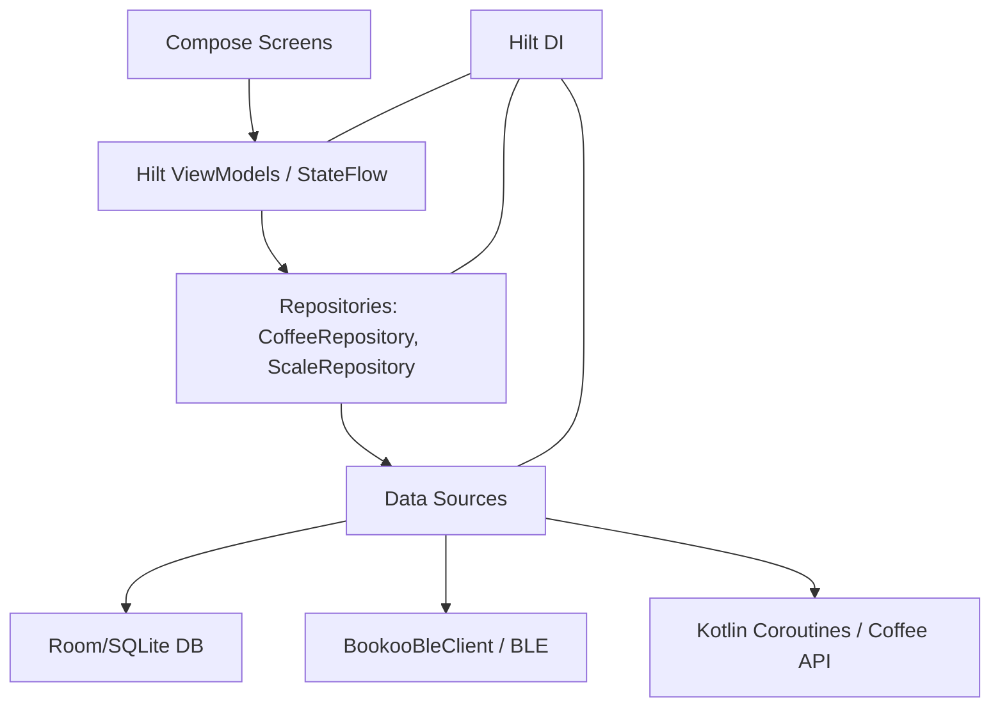

# ☕ Coffee Journal (Android Project)

[](https://developer.android.com/kotlin)
[](https://developer.android.com/about)
[](https://developer.android.com/training/dependency-injection/hilt-android)
[-4285F4)](https://developer.android.com/topic/libraries/architecture/room)
[](https://developer.android.com/guide/topics/connectivity/bluetooth/le)

Ett modernt kaffejournal byggt i **Kotlin** med **Jetpack Compose**. Appen är designad för kaffeentusiaster och erbjuder integration med smarta vågar via **Bluetooth Low Energy (BLE)** för realtidsdata, samt robust lokal datalagring för bryggningshistorik.

---

## Innehåll
- [Projektstruktur](#-projektstruktur)
- [Mappstruktur](#-mappstruktur)
- [Kom igång (Build & Run)](#-kom-igång-build--run)
- [Funktioner](#-funktioner)
- [Arkitektur](#-arkitektur)
- [Avancerade Kotlin/Android-koncept som används](#-avancerade-kotlinandroid-koncept-som-används)
- [Testning](#-testning)
- [Katalog över viktiga filer](#-katalog-över-viktiga-filer)
- [License](#-license)

---

## 📁 Projektstruktur

Projektet är organiserat enligt moderna Android-standarder (Clean/MVVM-inspirerat) med fokus på Separation of Concerns:

| Projektstruktur  | Namn                | Beskrivning                                             |
|:-----------------|:--------------------|:--------------------------------------------------------|
| `ProjektAndroid` | Gradle Root         | Huvudapplikationen.                                     |
| `app`            | Android Application | Innehåller UI, ViewModels, Repositories och Datakällor. |

---

## 🧱 Mappstruktur

Kärnlogiken för appen finns under `app/src/main/java/com/victorkoffed/projektandroid/`:

```text
com.victorkoffed.projektandroid/
├─ di/                        # Hilt Modules för DI (DatabaseModule)
├─ data/
│  ├─ ble/                    # BookooBleClient (Hantera BLE-protokollet)
│  ├─ db/                     # Room (Entities, DAO, Database, Converters)
│  └─ repository/              # Repository-interfaces och implementations
├─ domain/                     # Domänmodeller (BleConnectionState, ScaleMeasurement)
└─ ui/
   ├─ navigation/              # Navigeringsvägar (Screen.kt)
   ├─ screens/                 # Compose-skärmar (Home, Brew, Scale, etc.)
   ├─ theme/                   # Material 3-tema (Color, Type, Theme)
   └─ viewmodel/               # Hilt ViewModels (Logik, StateFlows)
```

---

## 🚀 Kom igång (Build & Run)

### Förutsättningar
- Android Studio (Giraffe 2022.3.1 eller nyare)
- Kotlin SDK (jvmToolchain(11))
- Android SDK (API 36 rekommenderas)
- Fysisk Android-enhet eller Emulator (krävs för BLE/CameraX)

### Steg
1. Klona repot.
2. Öppna i Android Studio.
3. Synkronisera Gradle (Gradle 8.13).
4. Välj målenhet och tryck **Run (Ctrl+F5)**.

---

## ⚙️ Funktioner

| Funktion                    | Beskrivning                                                                                             |
|:----------------------------|:--------------------------------------------------------------------------------------------------------|
| **Live Brew & BLE**         | Ansluter till Bookoo smart scale via Bluetooth och strömmar realtidsdata (vikt & flödeshastighet).      |
| **Visualisering**           | Visar vikt och flödesdata i en interaktiv graf (BrewSamplesGraph).                                      |
| **Datalagring**             | Robust lagring av alla data (Bönor, Bryggningar, Utrustning, Mätdata) i Room (SQLite).                  |
| **Realtidsstatistik**       | Visar översikt: totala bryggningar, tillgänglig bönvikt och tid sedan senaste kaffe (inkl. arkiverade). |
| **Bönarkivering**           | Möjlighet att arkivera bönor när lagersaldot når noll.                                                  |
| **Redigera Bryggdetaljer**  | Möjlighet att redigera sparade brygginställningar och anteckningar.                                     |
| **Vågminne & Auto-connect** | Stöder "Kom ihåg våg" och automatisk återanslutning.                                                    |
| **Mörkt Läge**              | Manuell växling för Ljust/Mörkt tema.                                                                   |
| **Fotohantering**           | CameraX används för att spara URI till bryggningsbild med stöd för fullskärmsvisning.                   |
| **Robust Live Brew**        | Förbättrad hantering av frånkoppling under pågående inspelning.                                         |

---

## 🧱 Arkitektur



- **MVVM/MVI-inspirerad:** Compose Views observerar reaktiva `StateFlow` från ViewModels.
- **Repository Pattern:** Abstraherar datakällor genom `CoffeeRepository` och `ScaleRepository`.
- **Hilt/DI:** Automatisk beroendeinjektion av ViewModels, Repositories, Databas och BLE-klienter.

---

## 🧩 Avancerade Kotlin/Android-koncept som används

| Område                | Exempel i koden                                       | Förklaring                                                         |
|:----------------------|:------------------------------------------------------|:-------------------------------------------------------------------|
| Kotlin Flows          | `StateFlow`, `SharedFlow`, `combine`, `collectLatest` | Reaktivt dataflöde mellan DB, BLE och UI.                          |
| BLE-kommunikation     | `callbackFlow`, `BluetoothGatt`                       | Coroutines & Flows för asynkrona BLE-händelser.                    |
| Room Data             | `@DatabaseView`, `ForeignKey.CASCADE`                 | Avancerad databasmodellering med vyer och constraints.             |
| Coroutines            | `viewModelScope`, `withTimeoutOrNull`                 | Hanterar asynkrona operationer säkert.                             |
| CameraX               | `ImageCapture`, `ProcessCameraProvider`               | Enkel integration av foto i bryggningsflödet.                      |
| Nätverkskommunikation | `CoffeeImageRepositoryImpl`, `URL().readText()`       | Block-safe I/O utförd på Dispatchers.IO inuti en suspend-funktion. |

---

## 🧪 Testning

- **Enhetstester:** `app/src/test` – platshållare (ExampleUnitTest.kt)
- **Instrumenterade tester:** `app/src/androidTest` – platshållare (ExampleInstrumentedTest.kt)

Kör tester:
```bash
./gradlew test
```

---

## 📚 Katalog över viktiga filer

<details><summary><strong>Gradle/Konfiguration</strong></summary>

- `gradle/libs.versions.toml` – Central hantering av beroenden
- `app/build.gradle.kts` – Konfigurerar Android/Compose/Hilt/KSP
- `AndroidManifest.xml` – BLE- och kameratillstånd

</details>

<details><summary><strong>Data & Arkitektur</strong></summary>

- `data/repository/CoffeeRepository.kt` – Huvudkontrakt för databasåtkomst
- `data/db/DatabaseEntities.kt` – Room-entiteter & BrewMetrics (View)
- `data/ble/BookooBleClient.kt` – BLE-hantering
- `di/DatabaseModule.kt` – Hilt-modul för databas & repository

</details>

<details><summary><strong>UI & Navigation</strong></summary>

- `MainActivity.kt` – NavHost, Drawer, Hilt ViewModel-hämtning
- `ui/viewmodel/scale/ScaleViewModel.kt` – Hanterar BLE-logik & state
- `ui/screens/brew/LiveBrewScreen.kt` – Compose-skärm för realtidsbryggning

</details>

---

## 📜 License

MIT License

Copyright (c) 2025 BooKoo

Permission is hereby granted, free of charge, to any person obtaining a copy
of this software and associated documentation files (the "Software"), to deal
in the Software without restriction, including without limitation the rights
to use, copy, modify, merge, publish, distribute, sublicense, and/or sell
copies of the Software, and to permit persons to whom the Software is
furnished to do so, subject to the following conditions:

The above copyright notice and this permission notice shall be included in all
copies or substantial portions of the Software.

THE SOFTWARE IS PROVIDED "AS IS", WITHOUT WARRANTY OF ANY KIND, EXPRESS OR
IMPLIED, INCLUDING BUT NOT LIMITED TO THE WARRANTIES OF MERCHANTABILITY,
FITNESS FOR A PARTICULAR PURPOSE AND NONINFRINGEMENT. IN NO EVENT SHALL THE
AUTHORS OR COPYRIGHT HOLDERS BE LIABLE FOR ANY CLAIM, DAMAGES OR OTHER
LIABILITY, WHETHER IN AN ACTION OF CONTRACT, TORT OR OTHERWISE, ARISING FROM,
OUT OF OR IN CONNECTION WITH THE SOFTWARE OR THE USE OR OTHER DEALINGS IN THE
SOFTWARE.

**Link:** [Bookoo BLE Protocol](https://github.com/BooKooCode/OpenSource/blob/main/bookoo_mini_scale/protocols.md)
