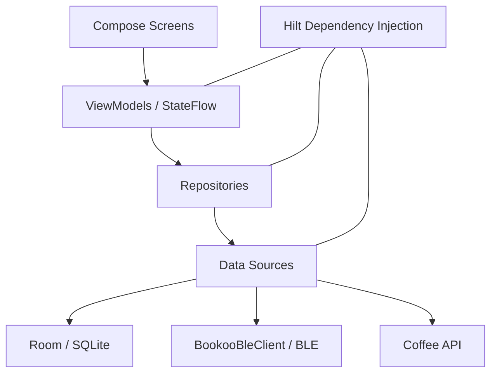
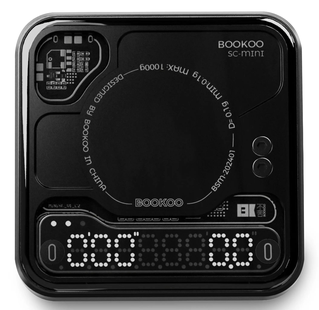

# ☕ Coffee Journal

[](https://developer.android.com/kotlin)
[](https://developer.android.com/about)
[](https://developer.android.com/training/dependency-injection/hilt-android)
[-4285F4)](https://developer.android.com/topic/libraries/architecture/room)
[](https://developer.android.com/guide/topics/connectivity/bluetooth/le)

## 📝 Introduktion

**Coffee Journal** är en native Android-applikation utvecklad i **Kotlin** och **Jetpack Compose** för att dokumentera, analysera och följa kaffebryggningar.

Appen kan kommunicera med smarta kaffevågar via **Bluetooth Low Energy (BLE)** och presenterar vikt och flödeshastighet i realtid under en pågående bryggning. Bryggningar, kaffebönor, utrustning och mätdata lagras lokalt i en **Room/SQLite-databas**.

Projektet kombinerar mobilutveckling, hårdvaruintegration och lokal datalagring. Fokus ligger på att skapa ett användarvänligt verktyg där användaren kan följa sina bryggningar över tid och få en tydligare bild av hur olika parametrar påverkar resultatet.

Appen innehåller bland annat stöd för:

- Realtidsdata från en smart kaffevåg via BLE.
- Visualisering av vikt och flödeshastighet under bryggning.
- Lagring och hantering av kaffebönor och bryggningar.
- Statistik och historik över tidigare bryggningar.
- Fotografering och koppling av bilder till bryggningar.
- Automatisk återanslutning till senast använda våg.
- Responsivt gränssnitt med Jetpack Compose och Material 3.

Projektet är utvecklat som ett individuellt högskoleprojekt med fokus på Android-utveckling, realtidsdata och integration med extern hårdvara.

---

## 📑 Innehåll

- [Projektstruktur](#-projektstruktur)
- [Mappstruktur](#-mappstruktur)
- [Kom igång](#-kom-igång)
- [Funktioner](#-funktioner)
- [Arkitektur](#️-arkitektur)
- [Kotlin/Android-koncept](#-kotlinandroid-koncept)
- [Testning](#-testning)
- [Skärmbilder & Demo](#-skärmbilder--demo)
- [Katalog över viktiga filer](#-katalog-över-viktiga-filer)
- [License](#-license)
- [AI-assistans](#-ai-assistans)
- [Projekt & Kurskontext](#-projekt--kurskontext)
- [Framtida utveckling](#-framtida-utveckling)

---

## 📁 Projektstruktur

Projektet är organiserat som en Android-applikation där användargränssnitt, presentation/state, datalager och externa integrationer hålls separerade.

| Del | Typ | Syfte |
|:---|:---|:---|
| `ProjektAndroid` | Gradle Root | Projektets övergripande nivå och Gradle-konfiguration. |
| `app` | Android Application | Innehåller appens UI, ViewModels, repositories, databashantering, BLE-kommunikation och dependency injection. |

Applikationen är strukturerad kring ett tydligt ansvar mellan olika lager:

- **UI** – Jetpack Compose-skärmar och användarinteraktion.
- **ViewModels** – Hanterar UI-state och koordinerar användarflöden.
- **Repositories** – Abstraherar åtkomst till data och externa datakällor.
- **Data** – Hanterar Room-databasen, BLE-kommunikation och externa datakällor.
- **Domain** – Innehåller domänmodeller som används av applikationen.
- **DI** – Hilt används för dependency injection och för att koppla samman applikationens komponenter.

---

## 🧱 Mappstruktur

Kärnlogiken för appen finns under:

`app/src/main/java/com/victorkoffed/projektandroid/`

```text
com.victorkoffed.projektandroid/
├─ di/                        # Hilt-moduler och dependency injection
├─ data/
│  ├─ ble/                    # BLE-kommunikation med smarta kaffevågar
│  ├─ db/                     # Room-databas, entities, DAO:er och converters
│  └─ repository/             # Repository-interface och implementationer
├─ domain/                    # Domänmodeller och applikationslogik
└─ ui/
   ├─ navigation/             # Navigation och routes
   ├─ screens/                # Jetpack Compose-skärmar
   ├─ theme/                  # Material 3-tema och UI-styling
   └─ viewmodel/              # ViewModels och hantering av UI-state
```

---

## 🚀 Kom igång

### Förutsättningar

För att bygga och köra projektet behöver du:

- Android Studio (Giraffe 2022.3.1 eller senare)
- Kotlin
- Gradle
- Android SDK (API 36 rekommenderas)
- En Android-enhet eller Android-emulator

> **Obs:** BLE-funktionerna kräver en fysisk Android-enhet med Bluetooth. En emulator kan användas för att testa övriga delar av applikationen, men rekommenderas inte för funktioner som kräver fysisk Bluetooth-kommunikation.

### Installera och starta

1. Klona repot.
2. Öppna projektet i Android Studio.
3. Låt Android Studio synkronisera Gradle-filerna.
4. Kontrollera att nödvändiga Android SDK-versioner är installerade.
5. Anslut en Android-enhet med USB-felsökning aktiverad eller starta en emulator.
6. Välj `app` som körkonfiguration.
7. Starta applikationen med **Run**.

Android Studio bygger då projektet och installerar applikationen på den valda enheten.

### Bygga från kommandoraden

Debug-versionen kan även byggas med Gradle:

```bash
./gradlew assembleDebug
```

Den resulterande APK-filen skapas under:

```text
app/build/outputs/apk/debug/
```

### BLE-funktioner

För att testa funktionerna som kommunicerar med en Bookoo-kaffevåg behöver:

- En kompatibel Bookoo-våg vara tillgänglig.
- Bluetooth vara aktiverat på Android-enheten.
- Appen ha de Bluetooth-behörigheter som krävs av Android-versionen.
- Vågen vara tillgänglig för anslutning.

BLE-kommunikationen hanteras av `BookooBleClient`.

---

## ⚙️ Funktioner

| Funktion | Beskrivning |
|:---|:---|
| **Live Brew & BLE** | Ansluter till en Bookoo smart scale via Bluetooth Low Energy och visar vikt och flödeshastighet i realtid under bryggningen. |
| **Realtidsvisualisering** | Visualiserar vikt och flödesdata i en graf under pågående bryggning. |
| **Brew-historik** | Sparar och visar tidigare bryggningar med tillhörande mätdata och detaljer. |
| **Datalagring** | Lagrar kaffebönor, bryggningar, utrustning och mätdata lokalt med Room/SQLite. |
| **Bönhantering** | Skapa, redigera och arkivera kaffebönor som används i bryggningar. |
| **Redigera bryggningar** | Sparade bryggningar kan redigeras i efterhand. |
| **Realtidsstatistik** | Visar bland annat antal bryggningar, tillgänglig bönvikt och tid sedan senaste bryggning. |
| **Vågminne** | Sparar information om vilken kaffevåg som senast användes. |
| **Auto-connect** | Försöker automatiskt återansluta till den senast använda vågen. |
| **Robust BLE-hantering** | Hanterar frånkopplingar från vågen under en pågående bryggning och försöker återupprätta kommunikationen. |
| **Fotohantering** | Använder CameraX för att ta bilder och koppla dem till bryggningar. |
| **Mörkt läge** | Stöd för ljust och mörkt tema med Material 3. |
| **Responsivt UI** | Använder Jetpack Compose för ett flexibelt gränssnitt anpassat efter olika skärmstorlekar. |

---

## 🏗️ Arkitektur

Appen använder en **MVVM/MVI-inspirerad arkitektur** där Jetpack Compose ansvarar för presentationen och ViewModels hanterar UI-state och användarflöden.

Dataåtkomsten abstraheras genom repositories, medan separata datakällor ansvarar för lokal datalagring, BLE-kommunikation och externa API-anrop.


```mermaid
graph TD
  UI["Compose Screens"] --> VM["ViewModels / StateFlow"]
  VM --> Repo["Repositories"]
  Repo --> Data["Data Sources"]

  Data --> Room["Room / SQLite"]
  Data --> BLE["BookooBleClient / BLE"]
  Data --> Network["Coffee API"]

  DI["Hilt Dependency Injection"] --- VM
  DI --- Repo
  DI --- Data
```

### UI och state

Jetpack Compose används för appens användargränssnitt. Skärmarna observerar state från ViewModels via bland annat `StateFlow`.

När state förändras kan Compose automatiskt uppdatera de delar av gränssnittet som påverkas.

### ViewModels

ViewModels fungerar som ett mellanlager mellan UI och repositories.

De ansvarar bland annat för:

- Hantering av UI-state.
- Koordinering av användarflöden.
- Kommunikation med repositories.
- Hantering av asynkrona operationer med Kotlin Coroutines och Flow.
- Hantering av realtidsdata från BLE.

### Repositories

Repositories abstraherar åtkomsten till applikationens olika datakällor.

Det gör att ViewModels inte behöver känna till detaljerna kring exempelvis:

- Room-databasen.
- BLE-kommunikation.
- Externa API-anrop.

Det skapar en tydligare separation mellan presentation och datahantering.

### Data layer

Data-lagret innehåller de konkreta implementationerna för applikationens datakällor.

Room / SQLite används för lokal lagring av bland annat:

- Kaffebönor.
- Bryggningar.
- Utrustning.
- Mätdata.

`BookooBleClient` ansvarar för kommunikationen med kaffevågen via Bluetooth Low Energy.

Externa datakällor hanteras separat från den lokala databasen och nås via repositories.

### Dependency Injection

Hilt används för dependency injection och för att hantera hur applikationens komponenter skapas och kopplas samman.

Det används bland annat för att tillhandahålla:

- Databasen.
- DAO:er.
- Repositories.
- BLE-klienten.
- ViewModels.

Det minskar kopplingen mellan komponenterna och gör strukturen enklare att testa och underhålla.

---

## 🧩 Kotlin/Android-koncept

| Område | Exempel i projektet | Användning |
|:---|:---|:---|
| **Kotlin Flow** | `StateFlow`, `SharedFlow`, `combine`, `collectLatest` | Används för reaktiv hantering av state och för att skicka förändringar mellan datalager, ViewModels och UI. |
| **Kotlin Coroutines** | `viewModelScope`, `withTimeoutOrNull`, `Dispatchers.IO` | Används för asynkrona operationer utan att blockera huvudtråden. |
| **BLE-kommunikation** | `callbackFlow`, `BluetoothGatt` | Används för att ta emot och hantera realtidsdata från kaffevågen via Bluetooth Low Energy. |
| **Room** | `@Database`, `@Dao`, `@Entity`, `@DatabaseView`, `ForeignKey.CASCADE` | Används för lokal lagring av bryggningar, bönor, utrustning och mätdata. |
| **Hilt** | Dependency injection-moduler | Används för att skapa och tillhandahålla databaser, repositories, BLE-klienter och andra beroenden. |
| **Jetpack Compose** | `@Composable`, Material 3, Compose State | Används för att bygga appens användargränssnitt och hantera UI-state. |
| **Jetpack Navigation** | `NavHost`, routes, `SavedStateHandle` | Används för navigation mellan appens olika skärmar och för att bevara navigeringsrelaterat state. |
| **CameraX** | `ImageCapture`, `ProcessCameraProvider` | Används för att ta bilder med enhetens kamera och koppla dem till bryggningar. |
| **Nätverkskommunikation** | `CoffeeImageRepositoryImpl`, `URL().readText()` | Används för att hämta extern information och bilder på `Dispatchers.IO`. |

---

## 🧪 Testning

Projektet innehåller både **enhetstester** och **instrumenterade tester**.

### Enhetstester

Enhetstester finns under:

```text
app/src/test/
```

Ett exempel är `BookooDataParserTest`, som testar parsningen av rådata från Bluetooth-kommunikationen.

Testerna kontrollerar bland annat att BLE-data tolkas korrekt för:

- Vikt.
- Flöde.
- Tid.

Enhetstesterna kan köras med Gradle:

```bash
./gradlew test
```

### Instrumenterade tester

Instrumenterade tester finns under:

```text
app/src/androidTest/
```

Dessa tester körs på en Android-enhet eller emulator och kan användas för att testa funktionalitet som är beroende av Android-ramverket.

De kan köras från Android Studio eller med Gradle:

```bash
./gradlew connectedAndroidTest
```

---

## 🖼️ Skärmbilder & Demo

### 📱 Wireframe

Grundidén för appens startsida.

<p>
  
</p>

### 📱 Mockup

En senare version av designen.

<p>
  
</p>

### 📲 Faktisk app

Den fungerande versionen av appen.

<p>
  
</p>

### ⚖️ Bookoo Smart Scale

Den smarta kaffevåg som används för att skicka bryggdata till appen via Bluetooth Low Energy.

<p>
  
</p>

### 🔄 Appens flöde

Översikt över appens huvudsakliga användarflöde.

<p>
  
</p>

### 🎬 Demo

<div align="center">
  <video src="https://github.com/user-attachments/assets/51382519-2b58-4130-84e8-cf8f1e16e673" autoplay loop muted playsinline width="250"></video>
</div>

---

## 📚 Katalog över viktiga filer

Här är några av de viktigaste filerna och komponenterna i projektet.

<details>
<summary><strong>Gradle och konfiguration</strong></summary>

- `gradle/libs.versions.toml` – Central hantering av versionsnummer och projektets beroenden.
- `app/build.gradle.kts` – Konfiguration för Android-applikationen, Compose, Hilt och KSP.
- `AndroidManifest.xml` – Appens deklarationer och behörigheter, bland annat för BLE och kamera.

</details>

<details>
<summary><strong>Data och arkitektur</strong></summary>

- `data/repository/interfaces/BrewRepository.kt` – Interface för hantering av bryggdata.
- `data/db/DatabaseEntities.kt` – Room-entiteter och modeller för bland annat bryggdata och mätvärden.
- `data/ble/BookooBleClient.kt` – Ansvarar för kommunikationen med Bookoo-vågen via Bluetooth Low Energy.
- `di/DatabaseModule.kt` – Hilt-konfiguration för databas och repositories.

</details>

<details>
<summary><strong>UI och navigation</strong></summary>

- `MainActivity.kt` – Appens startpunkt och konfiguration av navigation och huvudgränssnitt.
- `ui/viewmodel/scale/ScaleViewModel.kt` – Hanterar BLE-state och mätdata från vågen.
- `ui/screens/brew/LiveBrewScreen.kt` – Ansvarar för gränssnittet under en pågående bryggning.

</details>

---

## 📜 License

MIT License

Copyright (c) 2025 BooKoo

Permission is hereby granted, free of charge, to any person obtaining a copy
of this software and associated documentation files (the "Software"), to deal
in the Software without restriction, including without limitation the rights
to use, copy, modify, merge, publish, distribute, sublicense, and/or sell
copies of the Software, and to permit persons to whom the Software is
furnished to do so, subject to the following conditions:

The above copyright notice and this permission notice shall be included in all
copies or substantial portions of the Software.

THE SOFTWARE IS PROVIDED "AS IS", WITHOUT WARRANTY OF ANY KIND, EXPRESS OR
IMPLIED, INCLUDING BUT NOT LIMITED TO THE WARRANTIES OF MERCHANTABILITY,
FITNESS FOR A PARTICULAR PURPOSE AND NONINFRINGEMENT. IN NO EVENT SHALL THE
AUTHORS OR COPYRIGHT HOLDERS BE LIABLE FOR ANY CLAIM, DAMAGES OR OTHER
LIABILITY, WHETHER IN AN ACTION OF CONTRACT, TORT OR OTHERWISE, ARISING FROM,
OUT OF OR IN CONNECTION WITH THE SOFTWARE OR THE USE OR OTHER DEALINGS IN THE
SOFTWARE.

**Bookoo BLE Protocol:**  
[https://github.com/BooKooCode/OpenSource/blob/main/bookoo_mini_scale/protocols.md](https://github.com/BooKooCode/OpenSource/blob/main/bookoo_mini_scale/protocols.md)

---

## 🤖 AI-assistans

AI-verktyg har använts som stöd under utvecklingen av projektet.

### Verktyg som använts

- **ChatGPT** – idéarbete, felsökning, algoritmer och dokumentation.
- **Gemini** – kodförslag, felsökning och vissa delar av implementationen.

AI har framför allt använts som ett utvecklingsstöd. Förslag och genererad kod har granskats, anpassats och testats innan de använts i projektet.

Den slutliga implementationen samt beslut kring arkitektur och funktionalitet har gjorts av utvecklaren.

---

## 👥 Projekt & Kurskontext

Detta projekt utvecklades som ett individuellt projekt inom kursen:

**Systemutveckling för mobila applikationer II (7,5 hp)**  
(*System Development for Mobile Applications II, 7.5 credits*)

Projektet fokuserade på utveckling av en native Android-applikation som kommunicerar med extern hårdvara via Bluetooth Low Energy (BLE), hanterar realtidsdata och lagrar information lokalt.

### 🎯 Fokus i projektet

Arbetet omfattade bland annat:

- Utveckling av en native Android-app med Kotlin och Jetpack Compose.
- Kommunikation med en Bookoo-kaffevåg via Bluetooth Low Energy.
- Tolkning och hantering av data från vågens BLE-protokoll.
- Hantering av realtidsdata med Kotlin Coroutines och Flow.
- Lagring av bönor, bryggningar och mätdata med Room/SQLite.
- Repository-baserad struktur för att separera datahantering från UI och ViewModels.
- MVVM/MVI-inspirerad arkitektur.
- Dependency injection med Hilt.
- Integration med mobilens kamera via CameraX.
- Hantering av anslutning, frånkoppling och återanslutning till extern hårdvara.

### 🧠 Vad projektet gav erfarenhet av

Projektet gav framför allt praktisk erfarenhet av:

- Android-utveckling med Kotlin och Jetpack Compose.
- BLE-kommunikation och integration med extern hårdvara.
- Kotlin Coroutines, Flow och asynkron programmering.
- Realtidsdata och state-hantering i Android.
- Lokal datalagring med Room och SQLite.
- Dependency injection med Hilt.
- Arkitektur och separation av ansvar i en större Android-applikation.
- Att integrera hårdvara, datalager och användargränssnitt i samma applikation.

---

## 🚧 Framtida utveckling

Det finns flera saker som jag vill bygga vidare på i projektet:

1. Assisted brew med målvikt, tider och eventuellt ratio mellan kaffe och vatten.
2. Visa i grafen när bryggaren lyfts för att swirla.
3. Lägga till stöd för espresso-läge med Bookoo EM.
   - [Bookoo Espresso Monitor Protocol](https://github.com/BooKooCode/OpenSource/blob/main/espresso_monitor/protocols.md)
4. Lägga till rating för bryggningar och bönor.
5. Lägga till information om rostning.
6. Söka bland sparade bönor.
7. Lägga till stöd för vattenkemi.
8. Fler detaljer för bönor, exempelvis inköpspris, ursprungsland, region och smaknoter.
9. Lägga till recept, både färdiga och egna, samt eventuellt ett brew-timer-läge.
10. Lägga till stöd för DiFluid R2.
    - [DiFluid Developer SDK](https://digitizefluid.com/en-se/pages/difluid-developer-sdk-partnership)
11. Möjlighet att exportera bönor och brew-grafer till andra enheter eller användare.
12. Kunna använda en tidigare brew-graf som referens vid en ny bryggning.
13. Fixa landskapsläge i hela appen.
