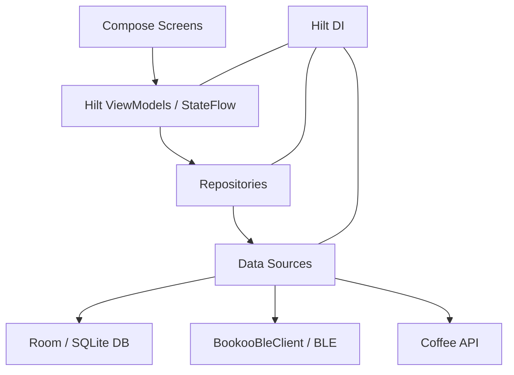

# ☕ Coffee Journal

[](https://developer.android.com/kotlin)
[](https://developer.android.com/about)
[](https://developer.android.com/training/dependency-injection/hilt-android)
[-4285F4)](https://developer.android.com/topic/libraries/architecture/room)
[](https://developer.android.com/guide/topics/connectivity/bluetooth/le)

Coffee Journal är en Android-app byggd i **Kotlin** och **Jetpack Compose** för att logga och följa kaffebryggningar.

Appen kan ansluta till smarta kaffevågar via **Bluetooth Low Energy (BLE)** och visa vikt och flödeshastighet i realtid. Bryggningar, bönor, utrustning och mätdata sparas lokalt i en **Room/SQLite-databas**.

---

## 📑 Innehåll

- [Projektstruktur](#-projektstruktur)
- [Mappstruktur](#-mappstruktur)
- [Kom igång](#-kom-igång)
- [Funktioner](#-funktioner)
- [Arkitektur](#️-arkitektur)
- [Kotlin/Android-koncept](#-kotlinandroid-koncept)
- [Testning](#-testning)
- [Skärmbilder](#-skärmbilder)
- [Katalog över viktiga filer](#-katalog-över-viktiga-filer)
- [License](#-license)
- [AI-assistans](#-ai-assistans)
- [Projekt & Kurskontext](#-projekt--kurskontext)
- [Framtida utveckling](#-framtida-utveckling)

---

## 📁 Projektstruktur

Projektet är uppdelat i UI, ViewModels, repositories och datakällor. Tanken är att hålla UI-koden separerad från exempelvis databas- och BLE-logik.

| Projektstruktur | Namn | Beskrivning |
|:---|:---|:---|
| `ProjektAndroid` | Gradle Root | Projektets huvudnivå. |
| `app` | Android Application | Innehåller UI, ViewModels, repositories, databaser och BLE-kommunikation. |

---

## 🧱 Mappstruktur

Kärnlogiken för appen finns under `app/src/main/java/com/victorkoffed/projektandroid/`:

```text
com.victorkoffed.projektandroid/
├─ di/                        # Hilt-moduler för dependency injection
├─ data/
│  ├─ ble/                    # BookooBleClient och BLE-kommunikation
│  ├─ db/                     # Room: Entities, DAO, Database och Converters
│  └─ repository/             # Repository-interface och implementationer
├─ domain/                    # Domänmodeller
└─ ui/
   ├─ navigation/             # Navigation och routes
   ├─ screens/                # Compose-skärmar
   ├─ theme/                  # Material 3-tema
   └─ viewmodel/              # ViewModels och StateFlows
```

---

## 🚀 Kom igång

### Förutsättningar

- Android Studio (Giraffe 2022.3.1 eller nyare)
- Kotlin
- Gradle
- Android SDK (API 36 rekommenderas)
- Android-enhet eller emulator

För att testa BLE-funktionerna behöver appen köras på en fysisk Android-enhet med Bluetooth.

### Steg

1. Klona repot.

2. Öppna projektet i Android Studio.

3. Synkronisera Gradle-filerna.

4. Anslut en Android-enhet eller starta en emulator.

5. Kör appen från Android Studio med **Run**.

Gradle kan även användas från kommandoraden:

```bash
./gradlew assembleDebug
```

---

## ⚙️ Funktioner

| Funktion | Beskrivning |
|:---|:---|
| **Live Brew & BLE** | Ansluter till en Bookoo smart scale och visar vikt och flödeshastighet i realtid. |
| **Visualisering** | Visar vikt och flödesdata i en graf under bryggningen. |
| **Datalagring** | Sparar bönor, bryggningar, utrustning och mätdata i Room/SQLite. |
| **Realtidsstatistik** | Visar bland annat antal bryggningar, tillgänglig bönvikt och tid sedan senaste kaffe. |
| **Bönarkivering** | Möjlighet att arkivera bönor när de inte längre finns kvar i lagret. |
| **Redigera bryggdetaljer** | Sparade bryggningar kan redigeras i efterhand. |
| **Vågminne** | Appen kan komma ihåg vilken våg som används. |
| **Auto-connect** | Försöker återansluta till den senast använda vågen. |
| **Mörkt läge** | Växla mellan ljust och mörkt tema. |
| **Fotohantering** | CameraX används för att ta och spara bilder till bryggningar. |
| **Robustare Live Brew** | Hanterar frånkopplingar från vågen under en pågående bryggning. |

---

## 🏗️ Arkitektur

Appen använder en MVVM/MVI-inspirerad struktur där Compose UI observerar state från ViewModels.


```mermaid
graph TD
  UI["Compose Screens"] --> VM["Hilt ViewModels / StateFlow"]
  VM --> Repo["Repositories"]
  Repo --> Data["Data Sources"]
  Data --> Room["Room / SQLite DB"]
  Data --> BLE["BookooBleClient / BLE"]
  Data --> Network["Coffee API"]
  DI["Hilt DI"] --- VM
  DI --- Repo
  DI --- Data
```

### UI och state

Compose-skärmarna lyssnar på `StateFlow` från ViewModels. När data ändras uppdateras UI:t automatiskt.

### Repository

Repositories används som ett mellanlager mellan ViewModels och datakällorna. Det gör bland annat att ViewModels inte behöver känna till hur data hämtas från Room eller BLE.

### Hilt

Hilt används för dependency injection och för att skapa och koppla ihop ViewModels, repositories, databasen och BLE-klienten.

### Data

Room används för lokal lagring medan `BookooBleClient` ansvarar för kommunikationen med vågen.

---

## 🧩 Kotlin/Android-koncept

| Område | Exempel i koden | Förklaring |
|:---|:---|:---|
| **Kotlin Flows** | `StateFlow`, `SharedFlow`, `combine`, `collectLatest` | Används för att skicka uppdateringar mellan datalager och UI. |
| **BLE-kommunikation** | `callbackFlow`, `BluetoothGatt` | BLE-data hanteras asynkront med Coroutines och Flow. |
| **Room** | `@DatabaseView`, `ForeignKey.CASCADE` | Används för lokal datalagring och relationer mellan data. |
| **Coroutines** | `viewModelScope`, `withTimeoutOrNull` | Hanterar asynkrona operationer och tidsbegränsade anrop. |
| **CameraX** | `ImageCapture`, `ProcessCameraProvider` | Används för att ta bilder från appen. |
| **Nätverkskommunikation** | `CoffeeImageRepositoryImpl`, `URL().readText()` | Hämtar data från externa källor på `Dispatchers.IO`. |
| **Jetpack Navigation** | `SavedStateHandle` | Används för att behålla navigeringsrelaterat state. |
| **Jetpack Compose** | `@Composable`, `StateFlow`, Material 3 | Används för appens gränssnitt och UI-state. |

---

## 🧪 Testning

Enhetstester finns under:

```text
app/src/test
```

Bland annat finns tester för parsning av rå BLE-data.

### BookooDataParserTest

Testet kontrollerar att data från Bluetooth-paket kan tolkas korrekt, bland annat:

- vikt
- flöde
- tid

Instrumenterade tester finns under:

```text
app/src/androidTest
```

Kör enhetstester med:

```bash
./gradlew test
```

---

## 🖼️ Skärmbilder

### 📱 Wireframe

Grundidén för appens startsida.

<p>
  
</p>

### 📱 Mockup

En senare version av designen.

<p>
  
</p>

### 📲 Faktisk app

Den fungerande versionen av appen.

<p>
  
</p>

### 📲 Flowchart

Översikt över appens flöde.

<p>
  
</p>

### 🎬 Demo

<div align="center">
  <video src="https://github.com/user-attachments/assets/51382519-2b58-4130-84e8-cf8f1e16e673" autoplay loop muted playsinline width="250"></video>
</div>

---

## 📚 Katalog över viktiga filer

<details>
<summary><strong>Gradle och konfiguration</strong></summary>

- `gradle/libs.versions.toml` – Central hantering av versionsnummer och beroenden.
- `app/build.gradle.kts` – Konfiguration för Android, Compose, Hilt och KSP.
- `AndroidManifest.xml` – Appens deklarationer och behörigheter för bland annat BLE och kamera.

</details>

<details>
<summary><strong>Data och arkitektur</strong></summary>

- `data/repository/interfaces/BrewRepository.kt` – Interface för bryggdata.
- `data/db/DatabaseEntities.kt` – Room-entiteter och `BrewMetrics`.
- `data/ble/BookooBleClient.kt` – Kommunikation med Bookoo-vågen.
- `di/DatabaseModule.kt` – Hilt-konfiguration för databas och repositories.

</details>

<details>
<summary><strong>UI och navigation</strong></summary>

- `MainActivity.kt` – Appens startpunkt, NavHost och drawer.
- `ui/viewmodel/scale/ScaleViewModel.kt` – Hanterar BLE-state och mätdata.
- `ui/screens/brew/LiveBrewScreen.kt` – Skärmen för realtidsbryggning.

</details>

---

## 📜 License

MIT License

Copyright (c) 2025 BooKoo

Permission is hereby granted, free of charge, to any person obtaining a copy
of this software and associated documentation files (the "Software"), to deal
in the Software without restriction, including without limitation the rights
to use, copy, modify, merge, publish, distribute, sublicense, and/or sell
copies of the Software, and to permit persons to whom the Software is
furnished to do so, subject to the following conditions:

The above copyright notice and this permission notice shall be included in all
copies or substantial portions of the Software.

THE SOFTWARE IS PROVIDED "AS IS", WITHOUT WARRANTY OF ANY KIND, EXPRESS OR
IMPLIED, INCLUDING BUT NOT LIMITED TO THE WARRANTIES OF MERCHANTABILITY,
FITNESS FOR A PARTICULAR PURPOSE AND NONINFRINGEMENT. IN NO EVENT SHALL THE
AUTHORS OR COPYRIGHT HOLDERS BE LIABLE FOR ANY CLAIM, DAMAGES OR OTHER
LIABILITY, WHETHER IN AN ACTION OF CONTRACT, TORT OR OTHERWISE, ARISING FROM,
OUT OF OR IN CONNECTION WITH THE SOFTWARE OR THE USE OR OTHER DEALINGS IN THE
SOFTWARE.

**Bookoo BLE Protocol:**  
[https://github.com/BooKooCode/OpenSource/blob/main/bookoo_mini_scale/protocols.md](https://github.com/BooKooCode/OpenSource/blob/main/bookoo_mini_scale/protocols.md)

---

## 🤖 AI-assistans

AI-verktyg har använts som stöd under utvecklingen av projektet.

### Verktyg som använts

- **ChatGPT** – idéarbete, felsökning, algoritmer och dokumentation.
- **Gemini** – kodförslag, felsökning och vissa delar av implementationen.

AI har framför allt använts som ett hjälpmedel under utvecklingen. Förslag och genererad kod har granskats och anpassats innan de använts i projektet.

Den slutliga implementationen och besluten kring arkitektur och funktionalitet har gjorts av utvecklaren.

---

## 👥 Projekt & Kurskontext

Detta projekt utvecklades som ett individuellt projekt inom kursen:

**Systemutveckling för mobila applikationer II (7,5 hp)**  
(*System Development for Mobile Applications II, 7.5 credits*)

Projektet fokuserar på utveckling av en Android-app med extern hårdvara, lokal datalagring och realtidsdata från en Bluetooth-enhet.

### 🎯 Fokus i projektet

Arbetet omfattade bland annat:

- Utveckling av en native Android-app med Jetpack Compose.
- Kommunikation med en Bookoo-kaffevåg via Bluetooth Low Energy.
- Lagring av bönor, bryggningar och mätdata med Room/SQLite.
- Repository-baserad struktur för datahantering.
- MVVM/MVI-inspirerad arkitektur.
- Dependency injection med Hilt.
- Integration med mobilens kamera via CameraX.
- Hantering av realtidsdata från extern hårdvara.

### 🧠 Vad projektet gav erfarenhet av

Projektet gav framför allt erfarenhet av:

- Android-utveckling med Kotlin och Jetpack Compose.
- BLE-kommunikation och hårdvaruintegration.
- Kotlin Coroutines och Flow.
- Lokal datalagring med Room.
- Arkitektur och uppdelning av ansvar i en större Android-app.
- Hantering av state och realtidsdata.

---

## 🚧 Framtida utveckling

Det finns flera saker som jag vill bygga vidare på i projektet:

1. Assisted brew med målvikt, tider och eventuellt ratio mellan kaffe och vatten.
2. Visa i grafen när bryggaren lyfts för att swirla.
3. Lägga till stöd för espresso-läge med Bookoo EM.
   - [Bookoo Espresso Monitor Protocol](https://github.com/BooKooCode/OpenSource/blob/main/espresso_monitor/protocols.md)
4. Lägga till rating för bryggningar och bönor.
5. Lägga till information om rostning.
6. Söka bland sparade bönor.
7. Lägga till stöd för vattenkemi.
8. Fler detaljer för bönor, exempelvis inköpspris, ursprungsland, region och smaknoter.
9. Lägga till recept, både färdiga och egna, samt eventuellt ett brew-timer-läge.
10. Lägga till stöd för DiFluid R2.
    - [DiFluid Developer SDK](https://digitizefluid.com/en-se/pages/difluid-developer-sdk-partnership)
11. Möjlighet att exportera bönor och brew-grafer till andra enheter eller användare.
12. Kunna använda en tidigare brew-graf som referens vid en ny bryggning.
13. Fixa landskapsläge i hela appen.

